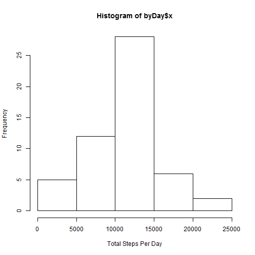
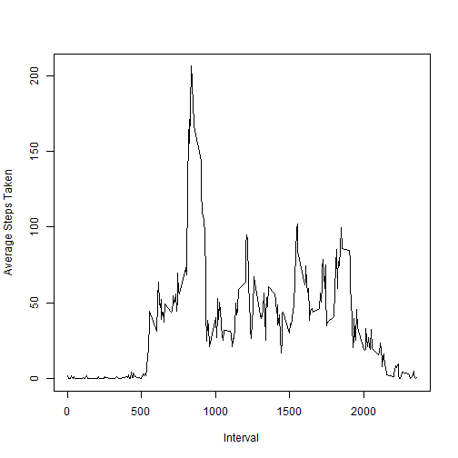

# Reproducible Research: Peer Assessment 1


## Loading and preprocessing the data

```r
unzip("./activity.zip")
acts <- read.csv("./activity.csv", colClasses = c("integer", "Date", "integer"))
```


## What is mean total number of steps taken per day? (Assumes no NA results counted)

```r
actsNoStepNa <- acts[!is.na(acts$steps), ]
byDay <- aggregate(actsNoStepNa$steps, by = list(date = actsNoStepNa$date), 
    sum)
hist(byDay$x, xlab = "Total Steps Per Day")
```

 

```r
mean(byDay$x)
```

```
## [1] 10766
```

```r
median(byDay$x)
```

```
## [1] 10765
```


## What is the average daily activity pattern? (Assumes no NA results counted)

```r
byInterval <- aggregate(actsNoStepNa$steps, by = list(inverval = actsNoStepNa$interval), 
    mean)
plot(byInterval$inverval, byInterval$x, type = "l", xlab = "Interval", ylab = "Average Steps Taken")
```

 


The max average five-minute interval is 835

```r
byInterval[byInterval$x == max(byInterval$x), c(1)]
```

```
## [1] 835
```


## Imputing missing values


## Are there differences in activity patterns between weekdays and weekends?
