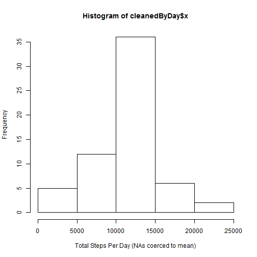
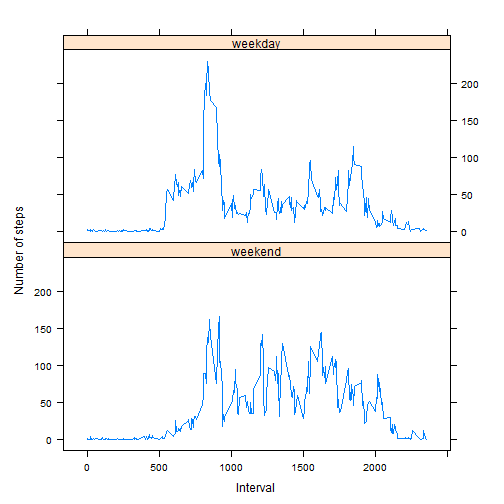

# Reproducible Research: Peer Assessment 1


## Loading and preprocessing the data

```r
unzip("./activity.zip")
acts <- read.csv("./activity.csv", colClasses = c("integer", "Date", "integer"))
```


## What is mean total number of steps taken per day? (Assumes no NA results counted)

```r
actsNoStepNa <- acts[!is.na(acts$steps), ]
byDay <- aggregate(actsNoStepNa$steps, by = list(date = actsNoStepNa$date), 
    sum)
hist(byDay$x, xlab = "Total Steps Per Day")
```

 

```r
mean(byDay$x)
```

```
## [1] 10766
```

```r
median(byDay$x)
```

```
## [1] 10765
```


## What is the average daily activity pattern? (Assumes no NA results counted)

```r
byInterval <- aggregate(actsNoStepNa$steps, by = list(interval = actsNoStepNa$interval), 
    mean)
plot(byInterval$interval, byInterval$x, type = "l", xlab = "Interval", ylab = "Average Steps Taken")
```

 


The max average five-minute interval is 835

```r
byInterval[byInterval$x == max(byInterval$x), c(1)]
```

```
## [1] 835
```


## Imputing missing values
There are 2304 missing rows

```r
nrow(acts[is.na(acts$steps), ])
```

```
## [1] 2304
```


Use interval mean to get rid of NA values,


```r
cleanedNa <- acts
all <- by(cleanedNa, 1:nrow(cleanedNa), simplify = TRUE, function(a) {
    if (is.na(a$steps)) {
        byInterval[byInterval$interval == a$interval, c(2)]
    } else {
        a$steps
    }
})
cleanedNa$cleanedSteps <- as.vector(all)
```


Confirm there are no more NA rows

```r
nrow(cleanedNa[is.na(cleanedNa$cleanedSteps), ])
```

```
## [1] 0
```


Updated graphs and values after supplying values for the data


```r
cleanedByDay <- aggregate(cleanedNa$cleanedSteps, by = list(date = cleanedNa$date), 
    sum)
hist(cleanedByDay$x, xlab = "Total Steps Per Day (NAs coerced to mean)")
```

 

```r
mean(cleanedByDay$x)
```

```
## [1] 10766
```

```r
median(cleanedByDay$x)
```

```
## [1] 10766
```


After supplying the mean value for the NA's, the median turned out to be the mean and you can notice in the updated histogram that there were more average values, which makes sense.


## Are there differences in activity patterns between weekdays and weekends?

Add weekday column to cleaned data

```r
cleanedNa$weekday <- weekdays(cleanedNa$date)
cleanedNa$weekClass <- ifelse(cleanedNa$weekday == "Saturday" | cleanedNa$weekday == 
    "Sunday", "weekend", "weekday")
cleanedNa$weekClass <- factor(cleanedNa$weekClass, levels = c("weekend", "weekday"))
```


```r
library(lattice)
byWeekend <- aggregate(cleanedNa$cleanedSteps, by = list(interval = cleanedNa$interval, 
    dayClass = cleanedNa$weekClass), mean)
xyplot(byWeekend$x ~ byWeekend$interval | byWeekend$dayClass, type = "l", xlab = "Interval", 
    ylab = "Number of steps", aspect = 0.5)
```

 


